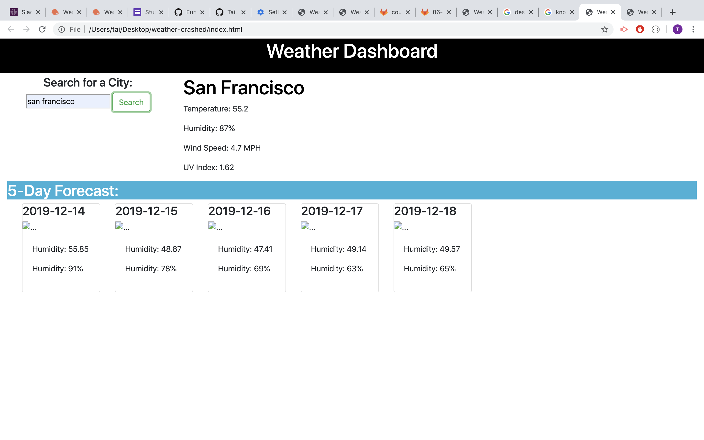

# weather-dashboard


## Summary
This is a weather dashboard. It runs 

## Techonologies Used
- Bootstrap - used to create components in a faster pace.
- CSS - used to style the layout of the page.
- GitHub - used to push and commit the page.
- Javascript - used to implement complex things on web pages.
- Weather api - to get all data of the weather by city name.
- Ajax - to call back the data and append it to HTML.

## Site Picture


## Code Snippet
```javascript
var dayForecast = "https://api.openweathermap.org/data/2.5/forecast?q=" + city + ",us" + "&appid=" + apiKey;
            $.ajax({
                url: dayForecast,
                method: "GET"
            }).then(function (response) {
                console.log(response)
                var currentDay = 1;
                for (var i = 0; i < response.list.length; i+=8) {
                    var data = response.list[i];
                    console.log(newDate)
                    //#day1()dynamic h2
                    var htmlPath = '#day' + currentDay + ' ';
                    var newDate = data.dt_txt.split(" ").shift()
                    $(htmlPath + 'h4').text(newDate)
                    // $(htmlPath + "img").append(data.i.icon)
                    // console.log(icon)
                    //TODO: implement other code above ++
                    $(htmlPath + "p:first-child").text("Humidity: " + convertKToF(+ data.main.temp))
                    $(htmlPath + "p:last-child").text("Humidity: " + data.main.humidity + "%")

                    currentDay++;
                }
            });
        });
```
These codes get the data through API and append those data inside a div and display them.

## Author Links
[LinkedIn](www.linkedin.com/in/tu-tai-le-2a9646139)
[GitHub](https://github.com/TaiLe96)